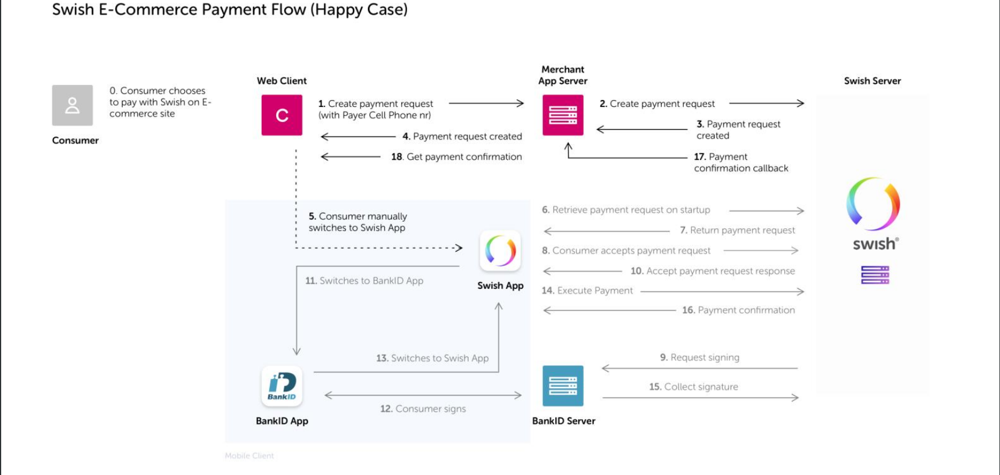

# Swish Payments

## Payment flow

In this implementation we will be taking a look at web implementation using Rails 6 as a server. This flow is typically used when the consumer initiates the payment in the merchant’s website in a desktop
environment. In this case the consumer needs to open the Swish-app manually after starting the payment. If
the payment is completed successfully, a payment confirmation screen will be displayed in the Swish app.



1. The consumer chooses to pay with Swish for a product or a service at the merchant website and enters
   his/her mobile phone number which is enrolled to Swish.
2. The merchant sends a payment request to the Swish system using the API. The transaction contains data such as: amount, receiving Swish-number, consumer’s mobile phone number, merchant payment reference and an optional message to the consumer.
3. The merchant website should inform the consumer to manually open the Swish app to confirm the
   transaction
4. The consumer opens the Swish app showing the payment request, which is preloaded with payment
   information.
5. The consumer clicks “pay” and the Mobile BankID app opens automatically for signing of the payment
   transaction.
6. The consumer confirms the payment transaction by signing with Mobile BankID.
7. The amount is transferred in real-time from the consumer’s account to the merchant’s account.
8. The consumer receives a payment confirmation in the Swish app.
9. The merchant receives a confirmation of successful payment.
10. The consumer receives a payment confirmation at the merchant website.
11. The consumer can view the payment as a sent payment in the events view in the Swish app.

Our payment request has a status and the Swish API will make a POST request to our callback URL when that status changes. The status changes can be the following:

- PAID - The payment was successful
- DECLINED - The payer declined to make the payment
- ERROR - Some error occurred, like the payment was blocked, payment request timed out etc.
- CANCELLED – The payment request was cancelled either by the merchant or by the payer via the merchant site

**The payment request will expire in 3 minutes.**

For the callback URL it is highly recommended that we use IP filtering. The Swish API will only make the request once.

## Setup

The Swish API uses TLS security protocol. We need to have the Swish merchant certificate (PKCS12 format) and the CA root certificate. For testing purposes the Swish API provides such test certificates which was added to this project root folder:

```
Swish_Merchant_TestCertificate_1231181189.p12
Swish_TLS_RootCA.pem
```

We will use `RestClient` to communicate with the API. Also we will need to expose our local server because the callback URL has to use HTTPS. A possible solution could be [ngrok](https://ngrok.com/).

Scaffold a rails 6 app and add `rest-client` gem. Generate a controller and add this method:

```ruby
class SwishController < ApplicationController

  private

  def swish_call(method, url, payload = {})
    p12 = OpenSSL::PKCS12.new(File.read("Swish_Merchant_TestCertificate_1231181189.p12"), "swish")
    cert_store = OpenSSL::X509::Store.new
    p12.ca_certs.each do | cert |
      cert_store.add_cert(cert)
    end
    RestClient::Request.execute({
      method: method,
      url: url,
      payload: payload.to_json,
      ssl_client_cert: p12.certificate,
      ssl_client_key: p12.key,
      ssl_cert_store: cert_store,
      ssl_ca_file: 'Swish_TLS_RootCA.pem',
      headers: { content_type: "application/json" }
      })
  end
end
```

- Here we use `OpenSSL:PKCS12` class to extract out the client certificate, key and chain of trust from the `Swish_Merchant_TestCertificate_1231181189.p12` test certificate using the test password `swish`.
- After that we create an empty certificate store to store the chain of trust. We use the built in methods to iterate over and add those certificates to this store.
- Finally we add the client certificate, key and store to our call and point to the location of the root CA certificate `Swish_TLS_RootCA.pem`.
- This method will allow us to make contact with the Swish API.

## Payment Requests

### Create a payment request

At this point you need to expose your local server and have a URL with HTTPS. Have that URL ready and create the following method:

```ruby
  def create_payment
    payload = {
      callbackUrl: 'https://7b493249.ngrok.io/swish/callback', # replace it with your HTTPS endpoint
      payeeAlias: '1231181189',
      payerAlias: '46733235555',
      amount: 1000,
      currency: 'SEK'
    }
    response = swish_call(:post, 'https://mss.cpc.getswish.net/swish-cpcapi/api/v1/paymentrequests/', payload)
    render json: response.headers
  end
```

The params for this call:

- `callbackUrl`: Mandatory. URL that Swish will use to notify caller about the outcome of the Payment request. The URL has to use HTTPS.
- `payeeAlias`: Mandatory. The Swish number of the payee. The PKCS12 certificate should have the same number. Swish will check this and return error if the number does not match.
- `payerAlias`: The registered cellphone number of the person that makes the payment. It can only contain numbers and has to be at least 8 and at most 15 numbers. It also needs to match the following format in order to be found in Swish: country code + cellphone number (without leading zero). E.g.: 46712345678
- `amount`: The amount of money to pay. The amount cannot be less than 1 SEK and not more than 999999999999.99 SEK. Valid value has to be all numbers or with 2-digit decimal separated by a period. Number data type
- `currency`: The currency to use. **The only currently supported value is SEK**

If the call is successful it should return an empty response body with headers that look something like this:

```json
{
  "location": "https://mss.cpc.getswish.net/swish-cpcapi/api/v1/paymentrequests/432BCF663D524D2D81246ECA77A6CEFE",
  "server": "nginx/1.12.1",
  "connection": "keep-alive",
  "content_length": "0",
  "date": "Thu, 09 Jan 2020 12:51:28 GMT"
}
```

From these headers the `location` is what is important. That is the URL for retrieving the status of the payment request.

Now the user should be prompted to open his/her Swish app and complete the purchase. If he/she has done that we should receive something like this to our callback URL:

```ruby
{
  "id"=>"12C4788A3684411EAA95B3B2FD95D9E0",
  "payeePaymentReference"=>nil,
  "paymentReference"=>"A7BD9DD841DC4C41B039E3D55254B5E2",
  "callbackUrl"=>"https://7b493249.ngrok.io/swish/callback",
  "payerAlias"=>"46733235555",
  "payeeAlias"=>"1231181189",
  "currency"=>"SEK",
  "message"=>"",
  "errorMessage"=>nil,
  "status"=>"PAID",
  "amount"=>"1000",
  "dateCreated"=>"2020-01-09T13:13:43.561+0000",
  "datePaid"=>"2020-01-09T13:13:47.561+0000",
  "errorCode"=>nil,
  "swish"=>{
    "id"=>"12C4788A3684411EAA95B3B2FD95D9E0",
    "payeePaymentReference"=>nil,
    "paymentReference"=>"A7BD9DD841DC4C41B039E3D55254B5E2",
    "callbackUrl"=>"https://7b493249.ngrok.io/swish/callback",
    "payerAlias"=>"46733235555",
    "payeeAlias"=>"1231181189",
    "currency"=>"SEK",
    "message"=>"",
    "errorMessage"=>nil,
    "status"=>"PAID",
    "amount"=>"1000",
    "dateCreated"=>"2020-01-09T13:13:43.561+0000",
    "datePaid"=>"2020-01-09T13:13:47.561+0000",
    "errorCode"=>nil
    }
  }
```

In this implementation we will not utilize the callback URL, but use the `location` header to ping Swish API until we get back a change in status. Modify the create payment method like this:

```ruby
  def create_payment
    payload = {
      callbackUrl: 'https://7b493249.ngrok.io/swish/callback',
      payeeAlias: '1231181189',
      payerAlias: '46733235555', # cell phone number of the payer, it is mandatory for web applicaitons
      amount: 1000,
      currency: 'SEK'
    }
    response = swish_call(:post, 'https://mss.cpc.getswish.net/swish-cpcapi/api/v1/paymentrequests/', payload)
    body = ping_swish(response.headers[:location])
    render json: body
  end
```

And add the `ping_swish` method:

```ruby
  def ping_swish(order)
    sleep 4
    response = swish_call(:get, order)
    body = JSON.parse(response.body)
    body['status'] != 'CREATED' ? body : ping_swish(order)
  end
```

After these modification our initial call to `create_payment` action should return something like this:

```json
{
  "id": "522BCC20C779409485E4D23B6E52B9C7",
  "payeePaymentReference": null,
  "paymentReference": "B357089EA96C4157BB5FFBC8218CC0AB",
  "callbackUrl": "https://7b493249.ngrok.io/swish/callback",
  "payerAlias": "46733235555",
  "payeeAlias": "1231181189",
  "amount": 1000.0,
  "currency": "SEK",
  "message": "",
  "status": "PAID",
  "dateCreated": "2020-01-09T13:46:36.771Z",
  "datePaid": "2020-01-09T13:46:40.771Z",
  "errorCode": null,
  "errorMessage": null
}
```

Now we can let the client know that payment is processed and they could continue using the site.

### Cancel request

Cancellation is a PATCH request with the exact following payload:

```
PATCH /api/v1/paymentrequests/{id}

Content-Type: application/json-patch+json
```

```json
{
  "op": "replace",
  "path": "/status",
  "value": "cancelled"
}
```

The response returns the payment request with the status: `CANCELLED`

### Create refund

Refunds can be created by making a POST request with the following payload:

```
POST /api/v1/refunds
```

```json
{
  "originalPaymentReference": "5D59DA1B1632424E874DDB219AD54597",
  "callbackUrl": "https://example.com/api/swishcb/paymentrequests",
  "payerAlias": "1231181189",
  "amount": "100",
  "currency": "SEK",
  "message": "Refund for Kingston USB Flash Drive 8 GB"
}
```

In the response we get an empty body with the `location` header which is the URL for retrieving the refund. Once the refund is completed the provided `callbackUrl` is going to be called. We can also use the `location` header to retrieve the refund and check the status. When doing so we would get a response something like this:

```json
{
  "id": "2EA344A95DD941D1ACC2F94FBB898180",
  "paymentReference": "9374A9192E7343F39048E7061DB1DDF3",
  "payerPaymentReference": "",
  "originalPaymentReference": "5D59DA1B1632424E874DDB219AD54597",
  "callbackUrl": "https://example.com/api/swishcb/paymentrequests",
  "payerAlias": "1231181189",
  "payeeAlias": null,
  "amount": 100.0,
  "currency": "SEK",
  "message": "Refund for Kingston USB FlashDrive 8 GB",
  "status": "PAID",
  "dateCreated": "2019-01-04T10:29:43.683Z",
  "datePaid": "2019-01-04T10:29:52.543Z",
  "errorMessage": null,
  "additionalInformation": null,
  "errorCode": null
}
```
